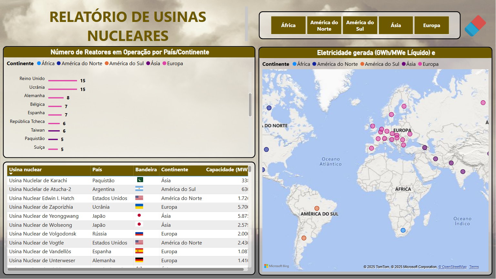

# Usinas Nucleares: Monitoramento Global

Painel de Power BI com visão consolidada das usinas nucleares no
mundo: localização, capacidade instalada e geração de eletricidade
por país.

🔗 [Ver relatório publicado](https://app.powerbi.com/view?r=eyJrIjoiYTQ4NDkxZGQtNmJkMy00YzE4LTgzOWYtYTY5YWIzM2U5ZjMzIiwidCI6IjY1OWNlMmI4LTA3MTQtNDE5OC04YzM4LWRjOWI2MGFhYmI1NyJ9)

---

## O Problema

Dados sobre usinas nucleares vêm de fontes internacionais dispersas,
cada uma com seu próprio padrão, idioma e formato. Sem consolidação,
fica difícil comparar países de forma justa: número de reatores não é
a mesma coisa que geração real, e essa distinção se perde numa tabela
crua.

## Dados

- **IAEA (International Atomic Energy Agency)**
- **World Nuclear Association**
- Bases públicas complementares (Excel/CSV, APIs)

## Tratamento e Modelagem

Unificação e padronização dos dados de reatores, produção, localização
e status operacional (ativa/inativa) num único dataset. Medidas em DAX
para comparar países por número de usinas, geração total e produção
média por reator.

## Tecnologias

| Camada | Tecnologia |
|---|---|
| Modelagem | Power BI Service, DAX |
| Visualização geográfica | Azure Maps |
| Fontes de dados | IAEA, World Nuclear Association, Excel/CSV, APIs públicas |

## Dashboard

Mapa interativo com a localização de cada usina, capacidade instalada
(MW) e energia gerada (GWh) por país, filtros por continente, status
e tipo de reator. Painel dividido em visão geral, análise por país,
mapa global e ranking, pra separar "quantos reatores tem" de "quanto
realmente produz".

## Principais Insights

Países com muitos reatores nem sempre são os que mais geram energia,
algo que não aparece numa lista simples de contagem. Isso serve de
base pra quem estuda matriz energética, política pública ou só quer
entender a distribuição real da energia nuclear no mundo, sem depender
de tabela dispersa por fonte.

## Imagens

## Como Reproduzir

Este painel foi construído no Power BI a partir de dados públicos da
IAEA e da World Nuclear Association. Não há pipeline de código
associado, o relatório publicado acima permite exploração interativa
completa dos filtros e visualizações.
